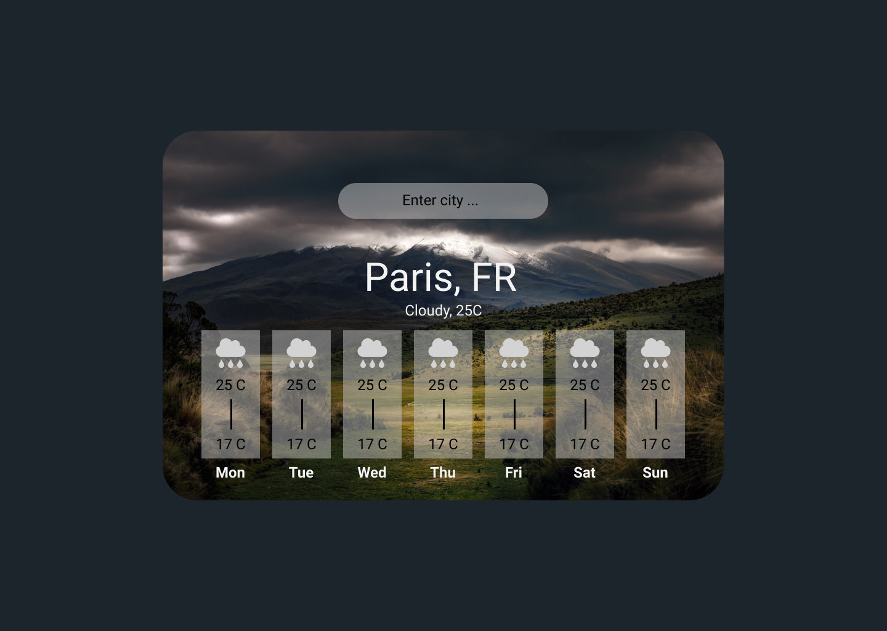
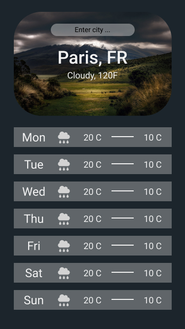

## A project for practicing the use of APIs / Async programming.

Stack:

- Frontend: ReactJS (https://reactjs.org)
- Styled-Components (https://styled-components.com)

## Project targets:

- Mobile friendly UI.
- Enter city into search field to get weather.
- Change background based on data (sunny, cloudy, rainy, snow).

Todo:

- [x] Wireframe / Layout
- [ ] Define components
- [ ] Build + style components with dummy data
- [ ] Implement weather API calls with promises
- [ ] Refactor API calls to Async / Await
