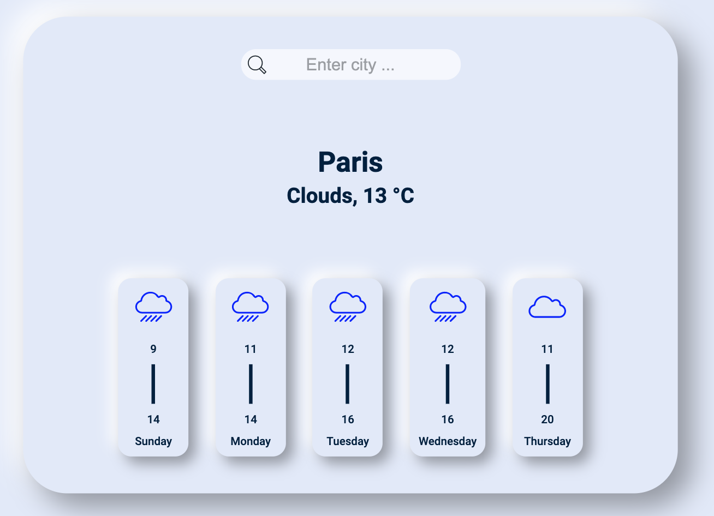

## A project for practicing the use of APIs / Async programming.

Stack:

- ReactJS (https://reactjs.org)
- Styled-Components (https://styled-components.com)

## Project targets:

- Mobile friendly UI.
- Enter city into search field to get weather.

Todo:

- [x] Wireframe / Layout
- [x] Define components
- [x] Build + style components with dummy data
- [x] Implement weather API calls with fetch API
- [x] Refactor API calls to Async / Await
